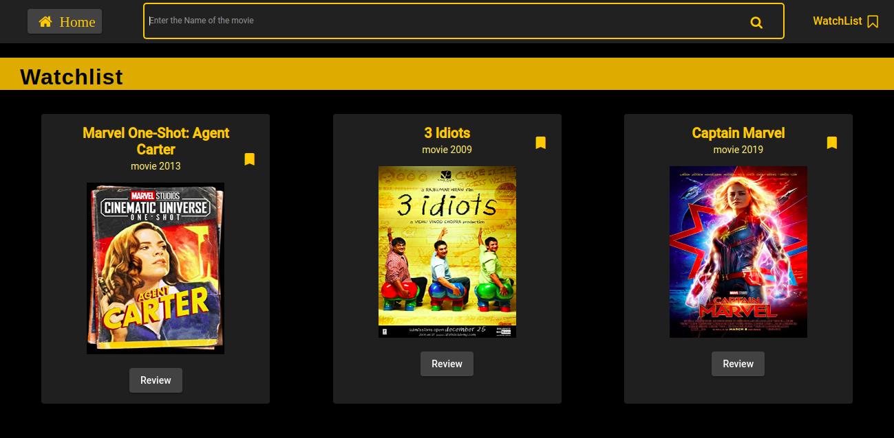

# Movie Cruiser App

In this Website user can search movies, add them to watchlist and submit a review.
This project was developed using **Angular v8**, **Angular material** for UI and **OMDb API** to Fetch the movie details.

## How to Install

1) Clone the repository on your system.
2) Run `npm install` inside the repository to install the required libraries.
3) Run `ng serve` to start a dev server.
4) Navigate to `http://localhost:4200/`.

## Screenshots
 - Home Page

- Search Results

- Watchlist

- Movie Details Page

